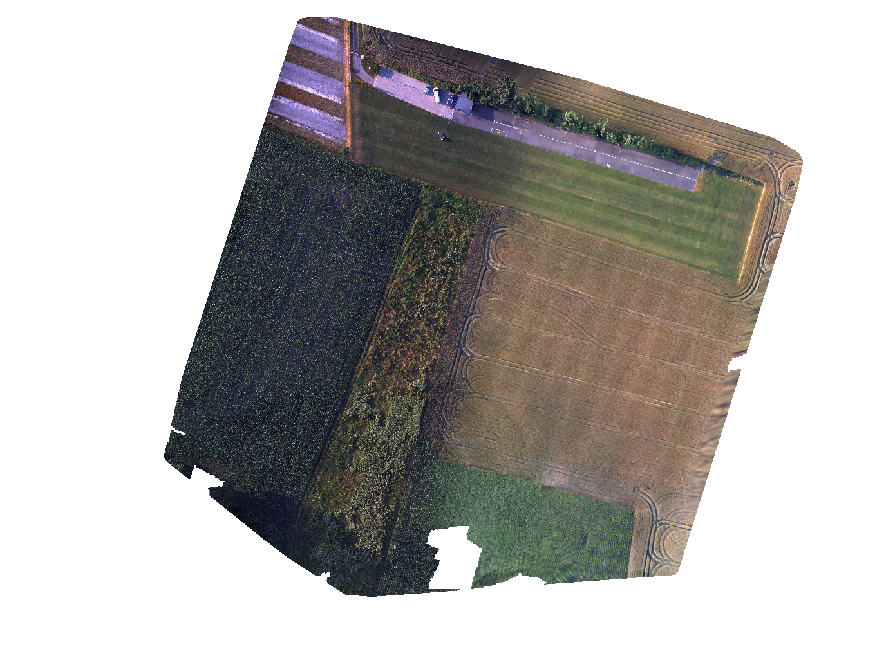
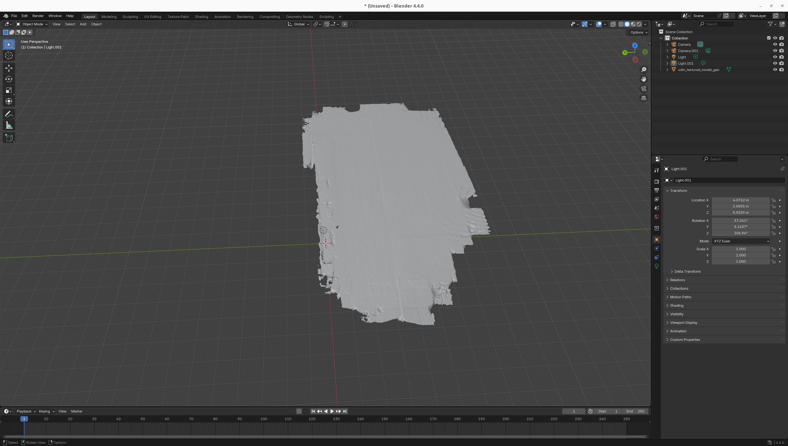
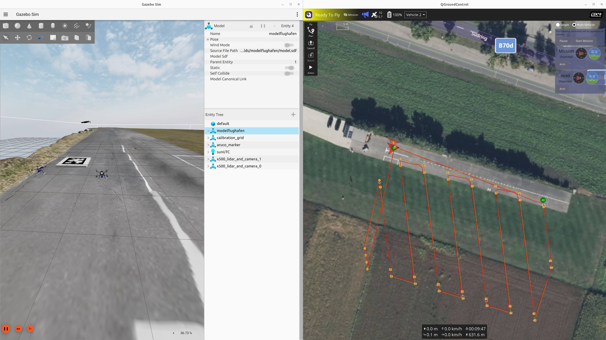

# Create custom world

## 3D Model Creation

To create a custom world first a 3D model of the environment and the objects in it is needed. This can be done with any 3D modeling software like Blender, Maya, Fusion 360 etc. or as in the case of the Modelflughafen world provided in this repository the 3D model can be created through photogrammetry with tools like [WebODM](https://opendronemap.org/webodm/). 



The model should be exported in a format [supported by Gazebo](https://discourse.openrobotics.org/t/mesh-formats-in-the-ignition-app/48729/2?u=gi_t) (e.g., .obj, .fbx, .dae).



Besides the format when exporting the model it's also important that the following properties are set correctly:
- The model origin (indicated by the white and red circle with arrows in the center of the model in Blender) should be at ground level (z = 0) and at a logical point in the model (e.g., start of the runway for the airport model).
- The scale of the model should be correct. You can use reference objects of known size in your modeling software to verify the scale.

## Create SDF World File

This section will start off with a brief overview of SDF files. For more detailed information please refer to [SDF worlds](https://gazebosim.org/docs/latest/sdf_worlds/) and the [SDFormat Specification](http://sdformat.org/spec).

A Gazebo world is defined in an SDF file (e.g. `world.sdf`) that describes physics, lighting, models, plugins etc.

```xml
<?xml version="1.0"?>
<sdf version="1.9">
  <world name="map">
    ...
  </world>
</sdf>
```

### Important SDF tags

Within `<world>`, some commonly used tags:

- `<physics>`
  Configure the physics engine (ODE in this example) and basic time-stepping:

  ```xml
  <physics type="ode">
    <max_step_size>0.001</max_step_size>
    <real_time_factor>1.0</real_time_factor>
    <real_time_update_rate>0</real_time_update_rate>
  </physics>
  ```

  Note: Ardupilot will give a Main loop slow (x < 400Hz) warning if the physics update rate is too low. You can reduce `max_step_size` or increase `real_time_update_rate` to fix this.
- `<light>`
  Define ambient/sun lights:

  ```xml
  <light name="sunUTC" type="directional">
    <pose>0 0 500 0 0 0</pose>
    <direction>0.001 0.625 -0.78</direction>
    ...
  </light>
  ```
- `<scene>`
  Visual settings like ambient light and sky:

  ```xml
  <scene>
    <ambient>0.4 0.4 0.4</ambient>
    <sky>false</sky>
  </scene>
  ```
- `<model>`
  Any object in the world: static environments, vehicles, sensors, etc. This is where the custom 3D environment mesh goes (see below).
- `<include>`
  Alternative to `<model>` when you want to pull in a model from a resource path/model database:

  ```xml
  <include>
    <uri>model://ground_plane</uri>
    <pose>0 0 0 0 0 0</pose>
  </include>
  ```
- `<plugin>`
  Gazebo "systems" are attached as world plugins:

  ```xml
  <plugin name="gz::sim::systems::NavSat" filename="gz-sim-navsat-system"/>
  ```

  These implement core sim functionality (sensors, physics system wrapper, scene broadcasting, etc).
- `<gravity>`
  Global gravity vector:

  ```xml
  <gravity>0 0 -9.81</gravity>
  ```

There are many more tags in SDF, but for a custom world these are the ones you typically touch.

### Adding the custom 3D world model

Your environment mesh is added as a static `<model>` with at least one `<link>` that contains both a `<visual>` and a `<collision>` element:

```xml
<model name="modelflughafen">
  <static>true</static>
  <pose>0 0 0 0 0 0</pose>
  <link name="link">
    <visual name="visual">
      <geometry>
        <mesh>
          <uri>modelflughafen.dae</uri>
        </mesh>
      </geometry>
    </visual>
    <collision name="collision">
      <geometry>
        <mesh>
          <uri>modelflughafen.dae</uri>
        </mesh>
      </geometry>
    </collision>
  </link>
</model>
```

Key points:
- `static` should be `true` for terrain / environment so it’s not simulated dynamically.
- The `<pose>` of the model is the world transform of your origin.
- **`<visual>` vs `<collision>`**:
  - `<visual>` defines what is rendered. It can use the high-poly, textured mesh so the world looks good.
  - `<collision>` defines the geometry used by the physics engine (contacts, raycasts, etc).
    - You can reuse the same mesh as the visual (as in the example) for convenience.
    - For performance and robustness, it’s often better to use a simplified collision mesh (decimated mesh or primitive shapes) and keep the detailed mesh only for the visual.

### Setting a GPS-referenced origin with `<spherical_coordinates>`

To tie the simulated world to real-world GPS coordinates, SDF provides `<spherical_coordinates>` in the `<world>` scope:

```xml
<spherical_coordinates>
  <surface_model>EARTH_WGS84</surface_model>
  <world_frame_orientation>ENU</world_frame_orientation>
  <latitude_deg>46.607213</latitude_deg>
  <longitude_deg>14.278461</longitude_deg>
  <elevation>446.0</elevation>
  <heading_deg>10.0</heading_deg>
</spherical_coordinates>
```

With `spherical_coordinates` set correctly and a `NavSat` system enabled:
- Simulated GPS messages in Gazebo use positions consistent with your chosen lat/long reference.
- Tools like QGroundControl can be configured so that the simulated vehicle appears at the correct real-world map location.
- Waypoints you place on the QGroundControl map will correspond to the correct locations on your photogrammetry world, letting you design realistic missions directly on the satellite map and fly them in simulation.

> Note: `ap/geopose/filtered` currently doesn't reflect this information. For more info see https://github.com/ArduPilot/ardupilot_gz/issues/74. With PX4 this feature works as expected.



## Other options

- [Gazebo Terrain Generator](https://github.com/saiaravind19/gazebo_terrain_generator)